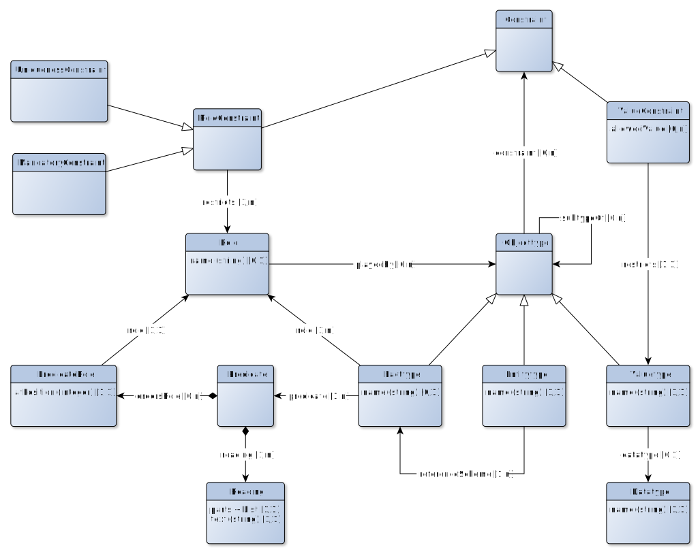
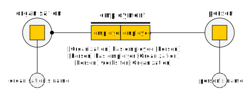

# Fact based modeling naar MIM

This document describes a mapping between Fact Based Modeling (FBM) and MIM (Metamodel voor Informatiemodelleren)

To perform such a mapping, it is necessary to have a metamodel (vocabulary) to express a FBM model. From this metamodel, we can describe the mapping to the metamodel of MIM.

Fact Based Modeling has many different dialects, among others: FCO-IM, CogNIAM and ORM. Multiple metamodels have been proposed for FBM, but no actual metamodel has been explicitly defined as ***the*** metamodel for FBM. This document uses a metamodel that is derived from the original notation for FBM as used by the ORM dialect and also used by the FCO-IM dialect.

Not all elements are yet available in this metamodel. We focus on the most fundamental elements.

## Metamodel voor Fact Based Modeling

Objecttypes can be Facttypes, Entitytypes or Valuetypes. Entitytypes refer to classes of real-world objects (Persons, things, places, events). Valuetypes refer to classes of values (like numbers, strings, dates). Facttypes refer to classes of facts about these real-world objects: properties or relations between them.

As Entitytypes refer to specific real-world objects, we need a reference scheme, like you reference a person by his or her full name, or maybe a social security number, or... As such, every Entitytype has one fact type as the preferred reference scheme.

A Valuetype has values that are of a specific datatype, like string or number. These Valuetypes might be constraint by a ValueConstraint. In the current metamodel, only ValueConstraints of the kind "allowed values" are included.

Facttypes can be unary, binary of n-ary. This refers to the roles that are associated to the fact type. Most facttypes are binary. Roles can be played by Entitytypes or Valuetypes. A facttype doesn't have to have a name, but should include at least one Predicate and for that Predicate a PredicateReading.

Predicates are used to state facts from fact types. For each predicate, we can have one or more readings: a sentence in a natural language that states the fact, so it is easy to read by non-modellers.

## Example

Let's look at the example below, a very simple fact based model with two entity types and one facttype:

- We introduce an Entitytype with the name "Person" and an Entitytype with the name "Organization"
- We introduce a Facttype with the name "Employment" with two roles
  - One role has name "employee" and is played by the Entitytype "Person"
  - The other role has name "employer" and is played by the Entitytype "Organization"

Let's now introduce the predicates. We will have two predicates:

- The first predicate places the roles in the order {employee, employer}, this predicate has two readings:
  - The reading ".. works for .." (abbreviated to "works for" as in binary fact types an infix predicate reading is expected)
  - The reading ".. has employee .." (abbreviated to "has employee")
- The second predicate places the roles in the order {employer, employee}, this predicate has one reading:
  - The reading ".. has employee .." (abbreviated to "has employee")

Predicates are used to verbalise the knowledge specified by the facttype. At least one predicate should be present. Names of fact types or roles are not actually needed, but can be useful to denote specific terms used in the domain.

Predicate readings can be abbreviated, but the full reading is also allowed. This means that the notation below depicts exactly the same facttype:

Uniqueness constraints are role constraints that are used to specify which combinations of roles will create a unique fact or refer to a unique entity. A uniqueness constraint is depicted as a line above the role. Mandatory constraints are used to specify that every single fact or entity should play that particular role. For that reason, mandatory constraints are also known as totality constraints. Mandatory constraints are depicted as a dot at the end of the line that depicts which objecttype plays the role.

Facttypes can be objectified. As such, a facttype can also play roles in other fact types. An objectified facttype always has a name. In the example above the entity type "Person" and "Organization" are actually drawn as objectified facttypes: the only difference is semantically: entity types refer to real-world things, whereas facttypes (only) refer to facts.

At least one predicate reading should exists for any facttype, but role names and facttype names are optional, as is made clear by the following example:

It doesn't make sense to talk about the name of the facttype ("the fact that a person lives somewhere" isn't a named fact!) and although you might speak about a "resident" as the role that is played by a person, this isn't a *proper* property of an address. We could even leave out the name of the role that is played by an address ("home address"), as the predicate reading is enough. And even if we don't want the predicate reading "lives at", we can always create a predicate reading using the role name: "[Person] has home address [Address]". When we use the shorthand notation for the predicate reading, it looks very elegant:

## Mapping of FBM to MIM

In the mapping below, we consider an fbm:Objecttype as an objectified fbm:Facttype or a fbm:Entitytype with its reference scheme, as the mapping of those two are identical in the current version of MIM, so:
- An objectified facttype can *have* roles and can *play* roles;
- An entitytype can *have* roles via its reference scheme and can *play* roles.

Valuetypes can only *play* roles and can never *have* roles. Only valuetypes are mapped to a datatypes.

### fbm:Objecttype to mim:Objecttype

- All fbm:Objecttype are translated to mim:Objecttype.
- The fbm:name of the fbm:Objecttype will be used as mim:name.

### fbm:subtype to mim:Generalisatie

- All fbm:subtypeOf are translated to mim:Generalisatie.
- The mim:subtype will map to the subject of the fbm:subtypeOf.
- THe mim:supertype will map to the object of the fbm:subtypeOf.

Mark that fbm:subtype can be used for both fbm:Objecttypes as fbm:Valuetypes. This corresponds with MIM, as mim:Generalisatie can be used for mim:Objecttype and mim:Datatype.

### fmb:Objecttype with fbm:role played by fbm:Valuetype to mim:Attribuutsoort

- All fbm:role that are played by fbm:Valuetype are translated to mim:Attribuutsoort.
- This mim:Attribuutsoort will be the mim:attribuut of the fbm:Objecttype that contains this fbm:Role.
- The fbm:name of the fbm:Role will be used as mim:name.
- If the name doesn't exists, the name of the fbm:Valuetype is used

### fbm:Objecttype with fbm:role played by fbm:Objecttype to mim:Relatiesoort

- All fbm:role that are played by fbm:Objecttype are translated to mim:Relatiesoort.
- This mim:Relatiesoort will have as mim:bron the fbm:Objecttype that contains this fbm:Role.
- This mim:Relatiesoort will have as mim:doel the fbm:Objecttype that plays this fbm:Role.
- The fbm:name of the fbm:Role will be used as mim:name.
- If this name doesn't exists, The textual predicate reading part will be used, for the predicate in which the mim:doel objecttype is in the second position.

### Unary fbm:Facttype

- All unary fbm:Facttypes are translated to mim:Attribuutsoort.
- The mim:type of this mim:Attribuutsoort will be mim:Boolean.
- The fbm:name of the fbm:Role will be used as mim:name.
- If this name doesn't exists, the textual predicate reading part will be used.

### Binary fbm:Facttype in which one of the fbm:roles is played by a fbm:Valuetype to mim:Attribuutsoort

- All binary fbm:Facttypes in which one of the fbm:roles is played by a fbm:Valuetype are translated to mim:Attribuutsoort.
- This mim:Attribuutsoort will be the mim:attribuut of the fbm:Objecttype that plays the other fbm:role.
- The fbm:name of the fbm:Role will be used as mim:name.
- If this name doesn't exists, the textual predicate reading part will be used, for the predicate in which the valuetype is in the second position.

### Binary fbm:Facttype in which both fbm:roles are played by fbm:Objecttypes to mim:Relatiesoort

- All binary fbm:Facttypes in which both fbm:roles are played by fbm:Objecttypes are translated to mim:Relatiesoort.
- The fbm:name of the fbm:Facttype will be used as mim:name.
- This mim:Relatiesoort will have as mim:bron the fbm:Objecttype that playes the first role in the predicate
- This mim:Relatiesoort will have as mim:doel the other objecttype that playes the second role in the predicate
- If more than one predicate exists, duplicate mim:Relatiesoorten will be created, in that case the predicate reading text will be used as mim:name
- If a fbm:Role has an fbm:name, that name is used for the corresponding mim:Relatierol.

### n-Ary fbm:Facttype

All n-Ary fbm:Facttypes are considered objectified facttypes and treated as such (e.g.: as fbm:Objecttypes)

MIM doesn't have solution for n-Ary relationships, so we must treat theses as objectified facttypes. In some cases, an n-Ary fbm:Facttype could be translated using a mim:Relatieklasse, but this is currently beyond the scope of this document.
